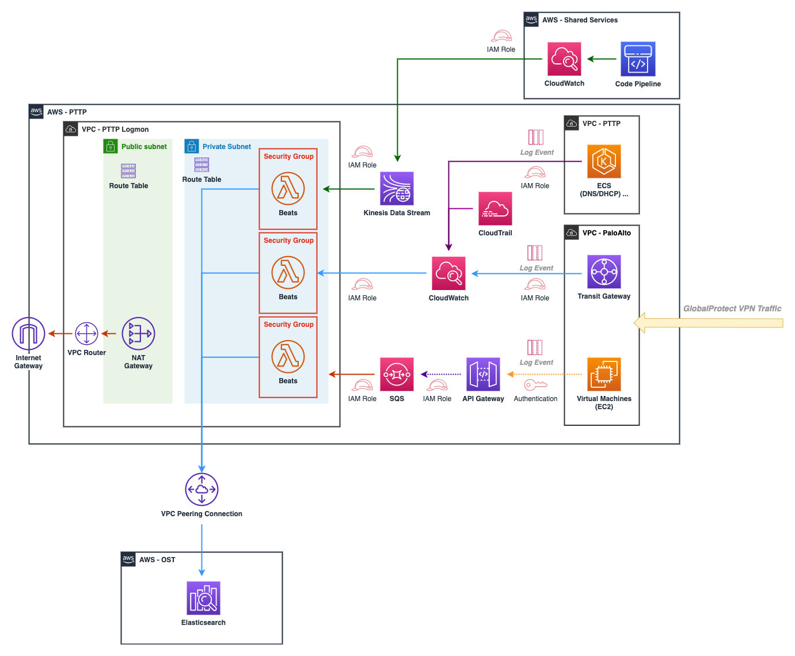

# Prison Technology Transformation Programme AWS Infrastructure

## Introduction

This project contains the Terraform code to build the Ministry of Justice's log-shipping platform.

The Terraform in this repository serves 2 purposes:

- (TODO: Flesh this out) Bootstrapping of the Development, Pre-production and Production environments on AWS.
- Creating the infrastructure for the log-shipping platform.

The Terraform in this repository can be run in 3 different contexts:

- Your own machine for bootstrapping AWS.
- By releasing features through the CodePipeline in the Shared Services Account (by pushing your changes to the `master` branch).
- Your own Terraform Workspace in the AWS Dev account for testing changes in an isolated workspace (further instructions below).

## Architecture

[Image Source](diagrams/architecture.drawio)

## Getting started

### Prerequisites

- [aws-vault](https://github.com/99designs/aws-vault) should be installed. This is used to easily manage and switch between AWS account profiles on the command line.
- [Terraform](https://www.terraform.io/) should be installed. We recommend using a Terraform version manager such as [tfenv](https://github.com/tfutils/tfenv).
- You should have AWS account access to at least the Dev and Shared Services AWS accounts (ask in the channel `#moj-pttp` in Slack if you don't have this).

### Set up aws-vault

Once aws-vault is installed, run the following two commands to create profiles for your AWS Dev and AWS Shared Services account:

- `aws-vault add moj-pttp-dev` (this will prompt you for the values of your AWS Dev account's IAM user).
- `aws-vault add moj-pttp-shared-services` (this will prompt you for the values of your AWS Shared Services account's IAM user).

### Set up MFA on your AWS account

Multi-Factor Authentication (MFA) is required on AWS accounts in this project. You will need to do this for both your Dev and Shared Services AWS accounts.

The steps to set this up are as follows:

- Navigate to the AWS console for a given account.
- Click on "IAM" under Services in the AWS console.
- Click on "Users" in the IAM menu.
- Find your username within the list and click on it.
- Select the security credentials tab, then assign an MFA device using the "Virtual MFA device" option (follow the on-screen instructions for this step).
- Edit your local `~/.aws/config` file with the key value pair of `mfa_serial=<iam_role_from_mfa_device>` for each of your accounts. The value for `<iam_role_from_mfa_device>` can be found in the AWS console on your IAM user details page, under "Assigned MFA device". Ensure you remove the text "(Virtual)" from the end of key value pair's value when you edit this file.

### Running the code

Run the following commands to get the code running on your machine:

- Run `aws-vault exec moj-pttp-shared-services -- make init` (if you are prompted to bring across workspaces, say yes).
- Run `aws-vault exec moj-pttp-shared-services -- terraform workspace new <myname>` (replace `<myname>` with your own name).
- Run `aws-vault exec moj-pttp-shared-services -- terraform workspace list` and make sure that your new workspace with your name is selected.
- If you don't see your new workspace selected, run `aws-vault exec moj-pttp-shared-services -- terraform workspace select <myname>`.
- Create a `terraform.tfvars` in the root of the project and populate it with the default developer Terraform settings. You can find a completed example of this in 1password7, in a vault named "PTTP". Update the filed `owner_email` to your own email address.
- Edit your aws config (usually found in `~/.aws/config`) to include the key value pair of `region=eu-west-2` for both the `profile moj-pttp-dev` and the `profile moj-pttp-shared-services` workspaces.
- Run `aws-vault exec moj-pttp-shared-services -- terraform plan` and check that for an output. If it appears as correct terraform output, run `aws-vault exec moj-pttp-shared-services -- terraform apply`.

### Once you are done working for the day

Run `aws-vault exec moj-pttp-shared-services -- terraform destroy`. This will tear down the infrastructure in your workspace.

### Testing

There is a testing suite called Terratest that tests modules in this codebase.
To run this codebase you will need to [install golang](https://formulae.brew.sh/formula/go).

To run the unit test, run:

- `cd test`
- `aws-vault exec pttp-development -- go test -v -timeout 30m`

To run a single unit test (in this case, one name "TestCloudTrailEventsAppearInCloudWatch"), run:

- `cd test`
- `aws-vault exec moj-pttp-shared-services -- go test -v -run TestCloudTrailEventsAppearInCloudWatch`

### Useful commands

- To log in to the browser-based AWS console using `aws-vault`, run either of the following commands:
  - `aws-vault login moj-pttp-dev` to log in to the dev account.
  - `aws-vault login moj-pttp-shared-services` to log in to the shared services account.

## Modules

There are various Terraform modules in this project that are called from the root `main.tf` file.

### Alarms

Sets up CloudWatch alarms for automatic monitoring and alerting of various metrics.

Alerting is done using SNS topics and subscriptions.

### Bootstrap

To do

### CloudTrail

Set up CloudTrail log forwarding to CloudWatch, so that CloudTrail logs are forwarded to the OST monitoring platform.

### Custom Logging API

This spins up an AWS API Gateway which is secured by an API key. JSON messages can be posted to the `/production/logs` endpoint
which will then be placed on an encrypted SQS queue to await further processing. The module provides four outputs:

- `logging_endpoint_path` - The full path to the logs endpoint on the API (Also exposed via `logging_api_endpoint_path` in the main outputs file for the project).
- `custom_logging_api_key` - The API key for the logging API. This should be provided to the API via the x-api-key header (also exposed via `logging_api_key`in the main outputs file for the project).
- `custom_log_queue_url` - The URL of the SQS queue onto which logs are placed.
- `custom_log_queue_arn` - The ARN of the SQS queue onto which logs are placed.

The API can be tested with the following curl command:

`curl -H "x-api-key: <custom_logging_api_key>" -H "Content-Type: application/json" -X POST <logging_endpoint_path> -d "{\"SomeKey\":\"SomeValue\"}"`

### Firewall Roles

To do

### Function Beats Config

To do

### IAM

To do

### Logging

To do

### Shared Services Log Destination Stream

To do

### VPC

Sets up the main VPC that the loggin infrastructure resides in.

### VPC Flow Logs

Forwards VPC Flow logs to CloudWatch, so that VPC Flow Logs are forwarded to the OST monitoring platform.

### VPC Peering

Sets up VPC peering to enable log forwarding to the OST monitoring platform.
