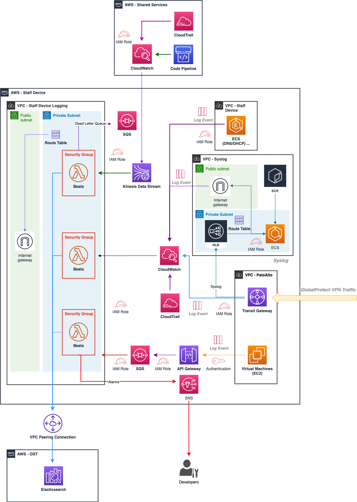

# Staff Device Logging Infrastructure

This is the Log Shipping infrastructure used by the [Ministry of Justice](https://www.gov.uk/government/organisations/ministry-of-justice) to forward logs to the Operational Security Team.

Below you will find various documentation about managing and running this service:

- [Getting Started](./documentation/getting_started.md)
  
- [Alarms](./documentation/alarms.md)
  
- [Deployment](./documentation/deployment.md)
  
- [Disaster Recovery](./documentation/disaster_recovery.md)
  
- [Connecting to Remote Elastic Search Cluster](./documentation/connecting_to_remote_elastic_search_cluster.md)
  
- [Sending new logs to OST](./documentation/sending_new_logs_to_ost.md)
  
- [Secrets Management](./documentation/secrets_management.md)
  
- [Security](./documentation/security.md)
  
- [FunctionBeat](./documentation/functionbeat.md)

- [Performance Benchmarks](./documentation/performance_benchmarks.md)

- [Architecture](./documentation/architecture.md)

[Image Source](./documentation/diagrams/architecture.drawio)
